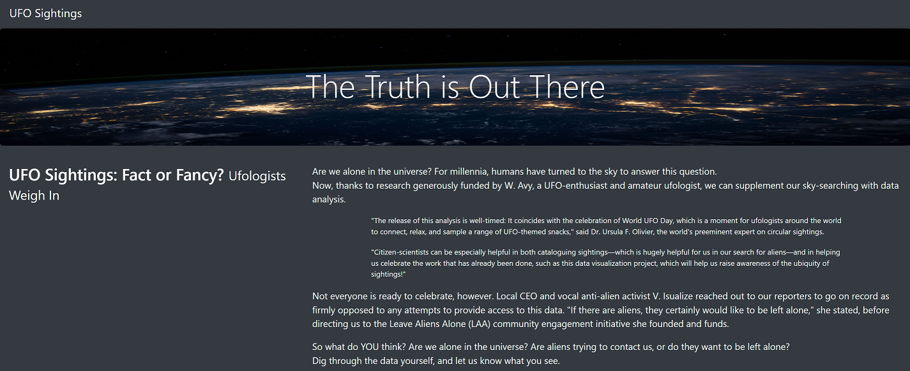
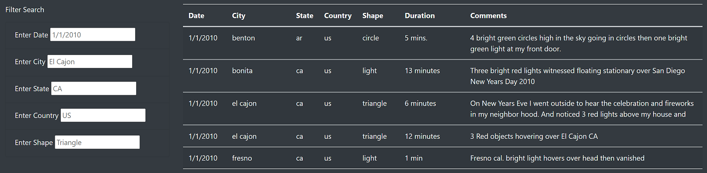
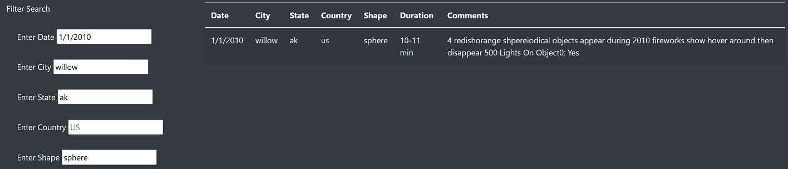

# UFOs

## Overview

Client requested an easy to use website, illustrating a filtered table of UFO sightings, gathered from archived data. Filters narrow down several sightings across the United States. HTML, Bootstrap, and Javascript allowed for an asthetic website.

## Results

UFO Website

### Before Applied Filters

- User initially will see (below) when site loads

### After Applied Filters

- User will see (below), for example, once inputing the desired filters, for example 

## Summary

### Drawback:

- Needing to be very specific with the filters
- User has to knnow EXACT date, shape, spelling, city
- Filters are case sensitive

### Recommendations

- Inclusion of date ranges and more user friendly filters to be not so specific
- NON case sensitive filters
